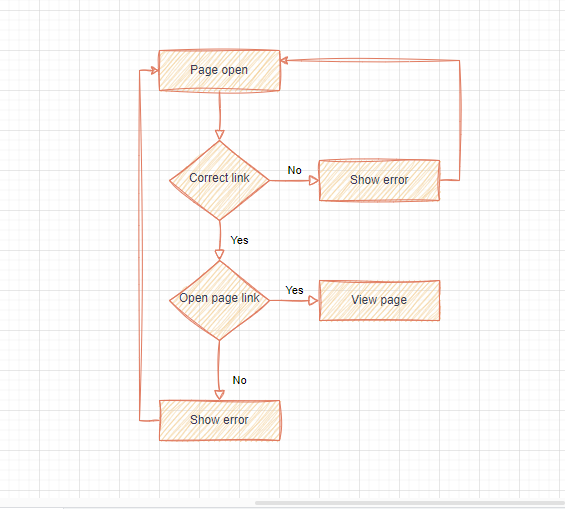

# **Capstone Project**

## **Project Overview**
In this project, I built my personal portfolio. These represent a few ways the project will be helpful:\
    1. Showcasing my skills.\
    2. Building my personal profile.\
    3. Optimizing user experience.\
    4. Links t code repositories.

## **Features and Functionality**
Main features:\
    1. Project showcase.\
    2. Link to cv/resume\
    5. Responsive design.\
    5. An integrated subscription button.

## **Technologies Used**
Front-End:\
    1. HTML\
    2. CSS\
    3. JavaScript\
Back-End:\
    1. Python(with Flask)\
    2. MySQL

## **Screenshots and demo**
[ProjectPrototype.html](./Prototype-Homepage.png)
[ProjectPrototype.html](./Prototype-Postpage.png)
[ProjectPrototype.html](./Prototype-Contactform.png)

## **Roadmap and future enhancements**
I would like to ensure that this application is fully accessible to users with disabilities, complying with accessibility standards and guidelines.

## **Contact information**
GitHub: Emmy-ck\
Email: ckenduiwa9876@gmail.com
